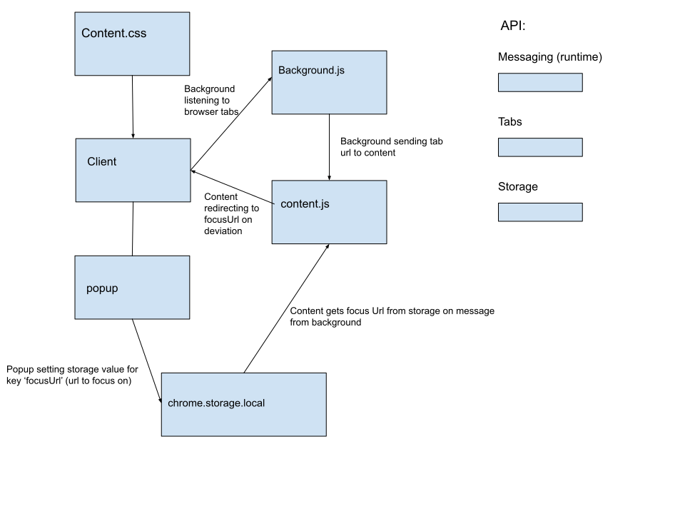

# Stay focused - youtube

A google chrome extension that focuses on a single youtube video and redirects back to the video when the user deviates to any other youtube video.

# Components



# Installation

#### Clone repositiory
```
git clone https://github.com/tzrtg/stay-focused
```
#### In chrome, navigate to extensions. 
chrome://extensions/
#### Click load unpacked and select stay-focused
#### Go a youtube video tutorial you would like to focus on and click the top 'stay-focus' (kirby) icon in browser
#### Then click focus
#### Click unfocus to unset 'focused' url


### Bug report / issues

1. background and content gets caught in a loop and keeps reloading the same url.
**occurrence:** rarely

2. hiding related videos only gets hidden after a page refresh.
**occurrence:** constant

tzrtg@protonmail.com

